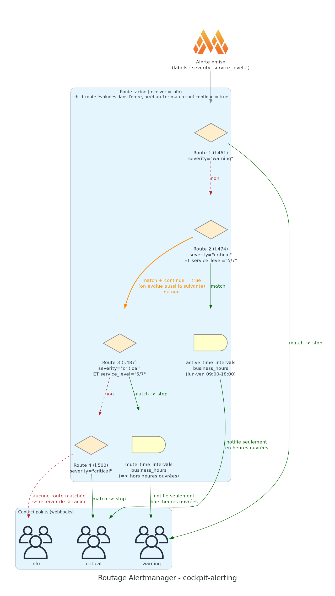

# Routage des alertes dans `cockpit-alerting` : matchers, `continue` et plages horaires

Source : `modules/cockpit-alerting/main.tf`, ressource `mimir_alertmanager_config.this`
(bloc `route`, lignes ~451-509).



Schéma généré avec le module Python [`diagrams`](https://diagrams.mingrammer.com/) (rendu Graphviz) :

```sh
cd /tmp/doc
uv run --with diagrams python grafana-route-macher.py
```

## 1. Les matchers d'une route sont un ET logique

```hcl
child_route {
  matchers = [
    "severity=\"critical\"",
    "service_level=\"5/7\"",
  ]
  ...
}
```

Une route ne matche que si l'alerte satisfait **tous** les matchers de la liste. Ici il faut donc
`severity="critical"` **et** `service_level="5/7"`. Une alerte `critical` sans label
`service_level` (ou avec `service_level="24/7"`) ne matche pas cette route.

Pour faire un **OU** :

- sur les valeurs d'un même label : utiliser une regex, par exemple `severity=~"critical|warning"` ;
- sur des labels différents : Alertmanager n'a pas de OU entre matchers, il faut plusieurs
  `child_route`.

## 2. Ordre d'évaluation et `continue`

Les `child_route` sont évaluées **dans l'ordre**, de haut en bas :

- à la première route qui matche, l'évaluation **s'arrête**,
- sauf si cette route a `continue = true` : dans ce cas, Alertmanager évalue aussi les routes
  suivantes ;
- si aucune route ne matche, l'alerte part vers le receiver de la route racine (`info`).

## 3. Les quatre routes du module

| # | Ligne | Matchers (ET) | Contact point | Plage horaire | `continue` |
|---|---|---|---|---|---|
| 1 | l.461 | `severity="warning"` | `warning` | toujours | non |
| 2 | l.474 | `severity="critical"` ET `service_level="5/7"` | `critical` | `active_time_intervals = ["business_hours"]` : notifie **seulement** en heures ouvrées | **oui** |
| 3 | l.487 | `severity="critical"` ET `service_level="5/7"` | `warning` | `mute_time_intervals = ["business_hours"]` : notifie **seulement** hors heures ouvrées | non |
| 4 | l.500 | `severity="critical"` | `critical` | toujours | non |
| - | racine | (aucun match) | `info` | toujours | - |

`business_hours` est défini par `var.business_hours` : du lundi au vendredi, `09:00`-`18:00`,
`Europe/Paris` par défaut. Les jours fériés ne sont pas gérés.

## 4. Pourquoi Grafana affiche deux policies identiques

Dans Grafana, `/alerting/routes?contactPoint=critical` et `/alerting/routes?contactPoint=warning`
affichent chacune une policy `severity = critical` + `service_level = 5/7`. Ce n'est pas un doublon :
ce sont les **routes 2 et 3**, qui ont les mêmes matchers mais :

- des **contact points** différents (`critical` pour l'une, `warning` pour l'autre) ;
- des **plages horaires** complémentaires : l'une est *active* pendant `business_hours`, l'autre est
  *muette* pendant `business_hours`.

Le filtre `?contactPoint=` de Grafana n'affiche que les policies qui envoient vers le contact point
choisi, d'où une policy dans chaque vue. En dépliant chaque policy, on doit voir :

- vers `critical` : **Active timings : business_hours** et **Continue matching** ;
- vers `warning` : **Mute timings : business_hours**.

## 5. Parcours de quelques alertes

| Alerte | Parcours | Résultat |
|---|---|---|
| `severity="warning"` | route 1 matche, stop | `warning` |
| `severity="critical"`, `service_level="5/7"`, mardi 10h | route 1 non, route 2 matche (active) avec `continue`, route 3 matche (muette), stop | `critical` |
| `severity="critical"`, `service_level="5/7"`, mardi 22h ou samedi | route 1 non, route 2 matche (inactive) avec `continue`, route 3 matche (active), stop | `warning` |
| `severity="critical"`, `service_level="24/7"` ou sans `service_level` | routes 1, 2, 3 non, route 4 matche, stop | `critical` (24h/24) |
| aucune `severity` connue | aucune route | `info` (racine) |

Pour une alerte `critical` en `5/7`, les routes 2 et 3 matchent toujours toutes les deux. C'est la
plage horaire qui décide laquelle notifie : à un instant donné, **une seule** est active. Comme la
route 3 n'a pas `continue`, ces alertes n'atteignent jamais la route 4 et ne partent donc pas vers
`critical` hors heures ouvrées.
